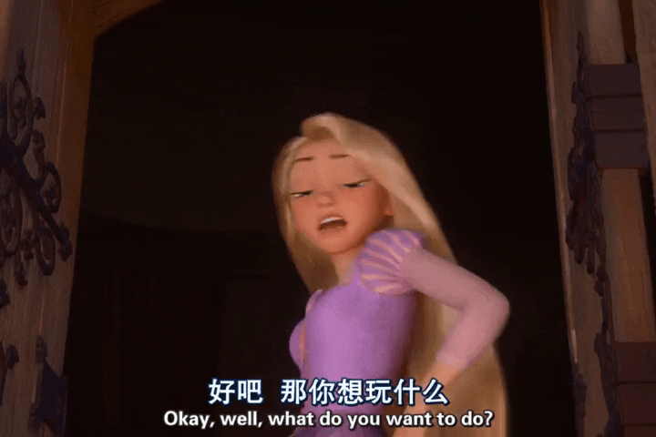
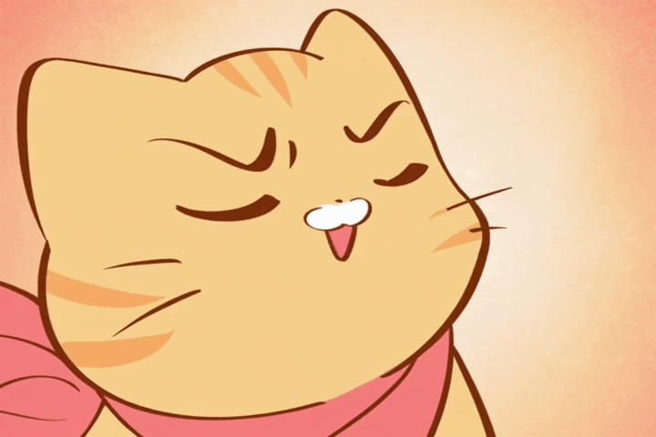
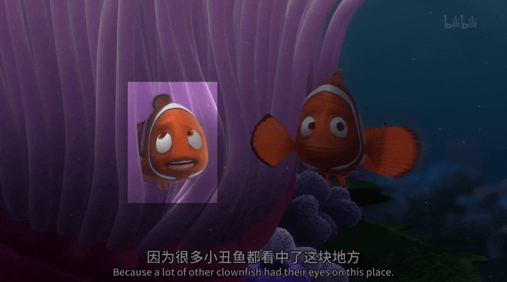

<div align="center">


</div>
<h2><center>AniSora: Exploring the Frontiers of Animation Video Generation in the Sora Era</h2>

<p align="center">
<a href='http://arxiv.org/abs/2412.10255'></a>

## 💡 Abstract
Animation has gained significant interest in the recent film and TV industry. Despite the success of advanced video generation models like Sora, Kling, and CogVideoX in generating natural videos, they lack the same effectiveness in handling animation videos. Evaluating animation video generation is also a great challenge due to its unique artist styles, violating the laws of physics and exaggerated motions. In this paper, we present a comprehensive system, **AniSora**, designed for animation video generation, which includes a data processing pipeline, a controllable generation model, and an evaluation dataset. Supported by the data processing pipeline with over 10M high-quality data, the generation model incorporates a spatiotemporal mask module to facilitate key animation production functions such as image-to-video generation, frame interpolation, and localized image-guided animation. We also collect an evaluation benchmark of 948 various animation videos, the evaluation on VBench and human double-blind test demonstrates consistency in character and motion, achieving state-of-the-art results in animation video generation.

**<span style="font-size:16px;"> Our evaluation benchmark are publicly available.</span>**

**<span style="font-size:16px;"> Experience Index-anisora model: Please contact jiangyudong@bilibili.com for more detailed information. </span>**

## 🖥️ Method

The overview of Index-anisora is shown as follows.

<picture>
  
</picture>

Features:

1. We develop a comprehensive video processing system that significantly enhances preprocessing for video generation.

2. We propose a unified framework designed for animation video generation with a spatiotemporal mask module, enabling tasks such as image-to-video generation, frame interpolation, and localized image-guided animation.

3. We release a benchmark dataset specifically for evaluating animation video generation.

## 📣 Updates

- `2024/12/19` 🔥🔥We submitted our paper on arXiv and released our project with evaluation benchmark.

## 🎞️ Showcases

**Image-generated videos in different artistic styles:**

| prmopt | image  | Video  |
| --- | --- | --- |
|The figures in the picture are sitting in a forward moving car waving to the rear, their hair swaying from side to side in the wind|  |.gif)|
|The scene shows two figures in red wedding clothes holding a red rope as they walk off into the distance|   |.gif)|
|The yellow-haired figure reaches out to touch the head of the kneeling figure, and the kneeling figure's body rises and falls as he gasps for breath.|   |.gif)|


**Temporal Control:**

| prmopt | first frame | mid frame| last frame  | Video  |
| --- | --- | --- | --- | --- |
|In this video we see a scene from the animated film Beauty and the Beast with Belle and the Beast. Belle, with long blonde hair, is standing in a room with large windows, looking out the window and talking to it. She is wearing a purple dress with a purple top...|  | | ||
|In this video, a young woman with long blonde hair can be seen looking out from behind a car door at night. The car is parked under a starry sky with a full moon illuminating the scene. The woman appears to be in a state of worry, as evidenced by her facial expression and the way she grips the car door. |   || ||
|A cartoon cat is the central figure in this video, which appears to be in a state of mischief or curiosity. The cat's eyes are closed and its mouth is open, suggesting a moment of surprise or anticipation...| ||||

**Spatial Control:**

| prmopt | first frame | motion mask |  Video(with motion mask visualization)  |
| --- | --- | --- | --- | 
|In this vibrant underwater scene from the animated film Finding Nemo, Marlin and Nemo, two clownfish, talk near a large purple piece of coral...|  | ||
|Same as above|  Same as above | ||


**<span style="font-size:18px;"> More videos are available in: [Video Gallery](https://pwz4yo5eenw.feishu.cn/docx/XN9YdiOwCoqJuexLdCpcakSlnkg) </span>**

## 📑 Evaluation

Evaluation results on Vbench:

| Method                   | Motion Smoothness | Motion Score | Aesthetic Quality | Imaging Quality | I2V Subject | I2V Background | Overall Consistency | Subject Consistency |
|--------------------------|-------------------|--------------|-------------------|-----------------|-------------|----------------|---------------------|---------------------|
| Opensora-Plan(V1.3)  | 99.13            | 76.45        | 53.21            | 65.11           | 93.53       | 94.71          | 21.67              | 88.86              |
| Opensora(V1.2)       | 98.78            | 73.62        | 54.30            | 68.44           | 93.15       | 91.09          | 22.68              | 87.71              |
| Vidu                 | 97.71            | **77.51**        | 53.68            | 69.23           | 92.25       | 93.06          | 20.87              | 88.27              |
| Covideo(5B-V1)       | 97.67            | 71.47        | **54.87**            | 68.16           | 90.68       | 91.79          | 21.87              | 90.29              |
| MiniMax              | 99.20            | 66.53        | 54.56            | **71.67**           | 95.95       | **95.42**          | 21.82              | 93.62              |
| **AniSora**              | **99.34**        | 45.59        | 54.31            | 70.58           | **97.52**       | 95.04          | 21.15              | **96.99**              |
| AniSora-K            | 99.12            | 59.49        | 53.76            | 68.68           | 95.13       | 93.36          | 21.13              | 94.61              |
| AniSora-I            | 99.31            | 54.96        | 54.67            | 68.98           | 94.16       | 92.38          | 20.47              | 95.75              |
| GT                   | 98.72            | 56.05        | 52.70            | 70.50           | 96.02       | 95.03          | 21.29              | 94.37              |

AniSora for our I2V results.

AniSora-K for the key frame interpolation results.

AniSora-I for the average results of frame interpolation conditions, including key frame, last frame, mid frame results.

## 🐳 Benchmark Dataset

The benchmark dataset contains 948 animation video clips are collected and labeled
with different actions. Each label contains 10-30 video clips. The corresponding text prompt is generated by Qwen-VL2 at first, then is corrected manually to guarantee the text-video alignment.

Fill the  <a href="assets/anisora_benchmark_agreement_form.doc">form</a> and send PDF format to xubaohan@bilibili.com or yangsiqian@bilibili.com (links provided after agreeing with Bilibili)

## 📚 Citation

🌟 If you find our work helpful, please leave us a star and cite our paper.

```
@article{jiang2024anisora,
  title={AniSora: Exploring the Frontiers of Animation Video Generation in the Sora Era},
  author={Yudong Jiang, Baohan Xu, Siqian Yang, Mingyu Yin, Jing Liu, Chao Xu, Siqi Wang, Yidi Wu, Bingwen Zhu, Qi Sen, Xingyu Zheng,Jixuan Xu, Yue Zhang, Jinlong Hou and Huyang Sun},
  journal={arXiv preprint arXiv:2412.10255},
  year={2024}
}
```